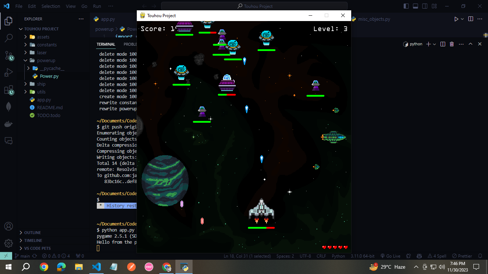
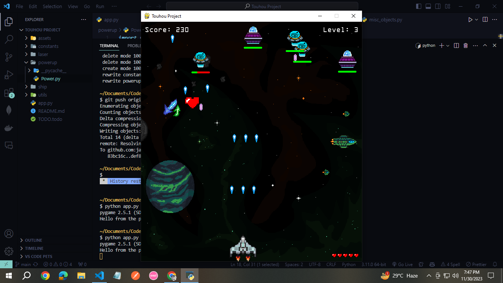
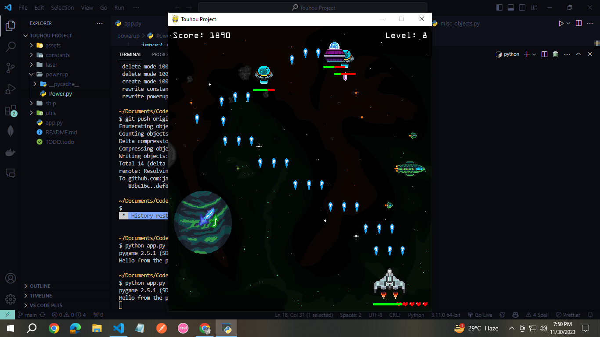
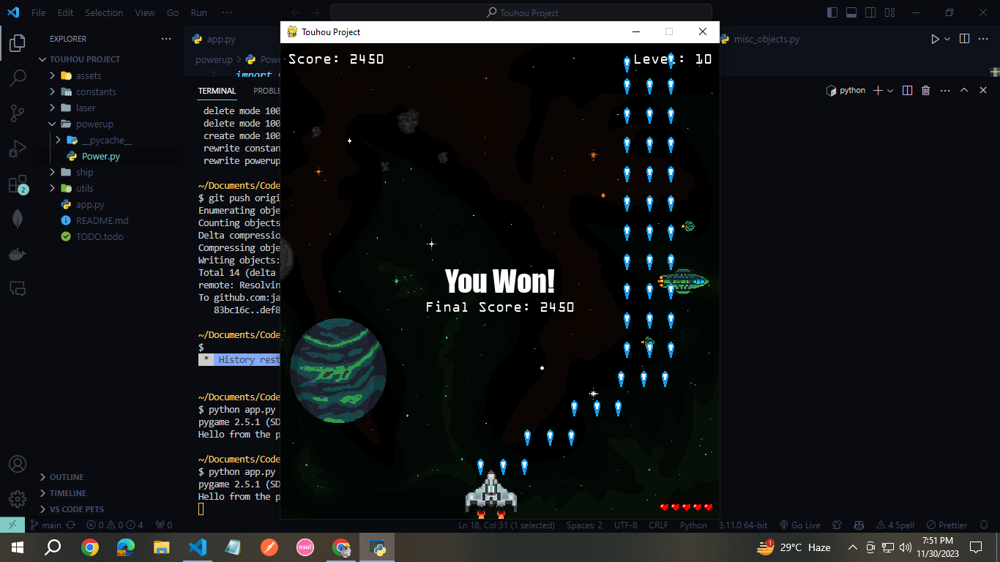
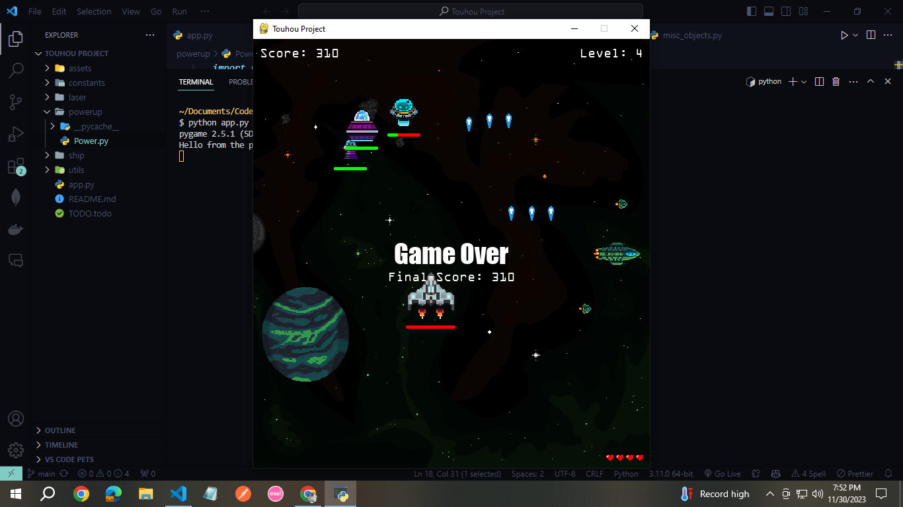

# Touhou Project 🚀

A simple pixel game inspired by the classic Japanese game Touhou Project.

## Setting Up ⚙️

### Prerequisites
Make sure you have Python and Pygame installed.
- [Python Installation](https://www.python.org/downloads/)
- [Pygame Installation](https://www.pygame.org/wiki/GettingStarted)

### Running the Game
Clone the repository:
```bash
git clone https://github.com/jaymart-padilla/touhou-project.git
```
Navigate to the project directory and run this on the terminal:
```bash
python app.py
```

## Game Mechanics
- Your spaceship is controlled using the WASD keys or arrow keys (up, down, left, right).
- Shoot down enemy spaceships to earn points.
- As you progress to higher levels, more enemies will appear at random intervals.
- Enemies will drop power-ups randomly, which can enhance your attack speed, add lasers/bullets, increase movement speed, and regenerate health.
- You start with 5 lives. One life is deducted for each enemy that passes through the screen. If you run out of lives, the game is over.
- Colliding with enemy ships or their bullets/lasers will reduce your spaceship's health. If your spaceship health reaches zero, the game is over.
- Reach level 10 to win the game.
  
### Controls
- Move Up: W or Arrow Up
- Move Down: S or Arrow Down
- Move Left: A or Arrow Left
- Move Right: D or Arrow Right

## Screenshots





